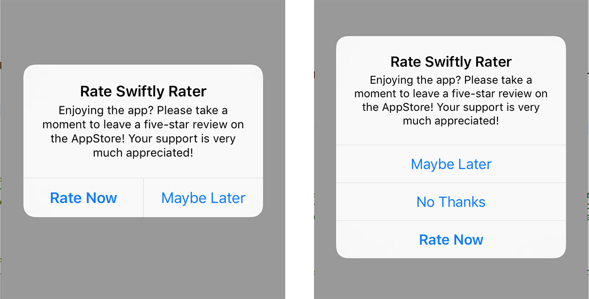

# SwiftlyRater
A simple and lightweight Review Manager for iOS, written in Swift 3

## Screenshots



## What is it?

At its core, SwiftlyRater is an UIAlertController which gets presented to users whenever specific conditions are met, giving them the option to rate your app. It's no mistery that users are more inclined to leave a bad review for an application when things don't function properly, rather than writing a positive review when everything works smoothly. SwiftlyRater aims to bring some balance to the game, so that your most loyal and active users are reminded to show their appreaciation with a nice review on the AppStore.

##### Easy to Setup

You can get SwiftlyRater up and running with just one line of code, no other configuration required.

##### Localization

SwiftlyRater currently supports 4 languages out of the box - English, Spanish, French, Italian - with more languages on the way!

##### Configurable

SwiftlyRater exposes an handful of properties you can customise to obtain the required behaviour for your app, nothing more than that!

##### Simple and Lightweight

SwiftlyRater has been built with simplicity in mind, keeping it simple and short by taking advantage of what Swift 3 has to offer. 

## Requirements

- iOS 10.0+

## Installation

### CocoaPods

First of all, install [CocoaPods](http://cocoapods.org) with the following command:

```bash
$ gem install cocoapods
```

Then add `SwiftlyRater` to your `Podfile`:

```ruby
use_frameworks!

target 'Your App Target' do
	pod 'SwiftlyRater'
end
```

Lastly run the following command:

```bash
$ pod install
```

## Usage

### Setup

To get SwiftlyRater up and running, you only need to add one line of code in your AppDelegate's `didFinishLaunchingWithOptions()`, passing the App Store ID associated to your app:

```swift
SwiftlyRater.sharedInstance.appId = "Your App ID"
```

SwiftlyRater will use its default configuration and criteria to determine when to present the review prompt to users.

##### Custom UI

The `applicationName` is primarily used in the title of the review popup, and by default it's dinamycally retrieved from your app `info.plist`. It can be changed to a specific name as following:

```swift
SwiftlyRater.sharedInstance.applicationName = "Your Custom Name"
```

The `reviewTitle` is the title of review popup, by default set to `Rate \<applicationame\>`. This can be customised too:

```swift
SwiftlyRater.sharedInstance.reviewTitle = "Custom Title"
```

The `reviewMessage` is the message of the review popup, by default set to `Enjoying the app? Please take a moment to leave a review on the AppStore! Your support is very much appreciated!`. To change it:

```swift
SwiftlyRater.sharedInstance.reviewMessage = "Custom Message"
```

The `neverRemindButtonTitle` determines the text to be used on the "Never Remind" button. Its default value is `No thanks`.

```swift
SwiftlyRater.sharedInstance.neverRemindButtonTitle = "Never Remind Title"
```

The `rateButtonTitle` determines the text to be used on the "Rate" button. Its default value is `Rate now`.

```swift
SwiftlyRater.sharedInstance.rateButtonTitle = "Rate Title"
```

The `remindButtonTitle` determines the text to be used on the "Remind" button. Its default value is `Maybe later`.

```swift
SwiftlyRater.sharedInstance.remindButtonTitle = "Remind Title"
```

### Custom Behaviour

The `usesUntilPrompt` property controls how many times the same version of your app needs to be used before the prompt is shown. A 'use' corresponds to the app being launched, while foregrounding it does not increase the use counter. Default value is `10`.

```swift
SwiftlyRater.sharedInstance.usesUntilPrompt = Int
```

The `daysUntilPrompt` property controls how many days need to elapse since the app was installed or updated before the popup is shown. Default value is `5`.

```swift
SwiftlyRater.sharedInstance.daysUntilPrompt = Int
```

The `eventsUntilPrompt` property determines how many "events" need to happen before the popup is shown. Default value is `10`.

```swift
SwiftlyRater.sharedInstance.eventsUntilPrompt = Int
```

This property can be used to capture signficant events that occurr in your app, so that only the most loyal users are presented with the review popup.
To inform SwiftlyRater that a signficant even has occurred, the following function needs to be called:

```swift
SwiftlyRater.sharedInstance.userDidPerformEvent(showPrompt: Bool)
```

Users are given the option to selected "Maybe Later" on the review popup. The `daysBeforeReminding` property determines how many days need to elapse before the popup is shown again to such users. Default value is `2`.

```swift
SwiftlyRater.sharedInstance.daysBeforeReminding = Int
```

The `shouldPromptIfRated` controls whether the review popup should be shown to users that have already reviewed the app or not. This can be set to false when releasing small updates so that users won't be asked to leave a review again for a version of the app almost identical to the previous one. Default value is `true`.

```swift
SwiftlyRater.sharedInstance.shouldPromptIfRated = Bool
```

The `shouldPrompAtLaunch` controls whether or not the review popup should be presented as soon as the app launches. Default value is `true`.

```swift
SwiftlyRater.sharedInstance.shouldPrompAtLaunch = Bool
```

When setting this property to false, the review popup won't ever show up - even if some conditions are met - unless the following function is called:

```swift
SwiftlyRater.sharedInstance.showPromptIfNeeded()
```

The `showNeverRemindButton` controls whether or not the review popup should include a third button, giving users the option not to show the popup again. Default value is `false`.

```swift
SwiftlyRater.sharedInstance.shouldPrompAtLaunch = Bool
```

The `useCustomLocalizationFile` determins which bundle to use to localize the review popup strings. By default this value is set `false`, meaning that SwiftlyRater will use its own bundle for translations. When setting this to `true`, you need to included in your app bundle a file called `SRLocalizable.strings` containing the necessary translated strings.

```swift
SwiftlyRater.sharedInstance.useCustomLocalizationFile = Bool
```

##### Debug Mode

The `debug` property can be used for testing purposes to enable logging and to present the review popup everytime the app is launched. Set to `false` by default.

```swift
SwiftlyRater.sharedInstance.debug = Bool
```

### Delegates

SwiftlyRater uses delegates to communicate that specifc events have occurred:

```swift
func swiftlyRaterDidShowPrompt() -> Void
func swiftlyRaterDidTapRate() -> Void
func swiftlyRaterDidTapDecline() -> Void
func swiftlyRaterDidTapRemind() -> Void
```

## What's Next?

These are just some ideas floating around, feel free to contribute!

- Ability to use custom UI rather than Apple `UIAlertController`
- Add more criteria/triggers to the review popup logic
- Improve localizations
- Unit Test coverage

## Feedback

The ultimate goal is to make SwiftlyRater the best Review Manager out there, so keep your feedback coming - be it via emails, bugs or pull requests!

## Acknoledgments

- [Appirater](https://github.com/arashpayan/appirater) for giving me inspiration and solid grounds where to start with SwiftlyRater.
- [Andyy Hope](https://medium.com/swift-programming/swift-userdefaults-protocol-4cae08abbf92#.3ujvonwx1) for an inspiring article on UserDefaults and Protocols.
- [Sauvik Dolui](https://medium.com/@sauvik_dolui/network-status-monitoring-on-ios-part-1-9a22276933dc#.ucogr6tft) for a great tutorial on Reachability. 

## License

SwiftlyRater is released under an MIT [LICENSE](https://github.com/gdimaggio/SwiftlyRater/blob/master/LICENSE).
